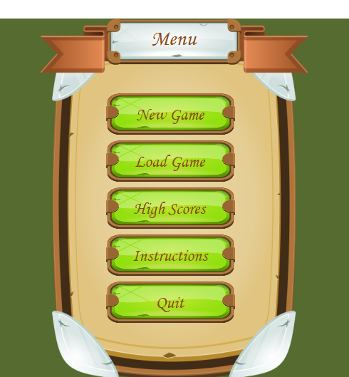
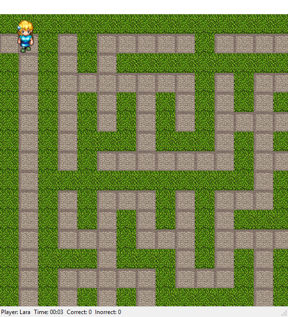

# Code Maze

## Опис на апликацијата

Code Maze е апликација која ја имплементира основната идеја на наоѓање на пат во лавиринт во одредено време, но со дополнителни прашања од областа на програмирање. Колку повеќе знаете, толку полесно ќе ја пронајдете целта.
Застапен е и натпреварувачкиот дух со зачувувањето на најдобрите резултати, за секоја тежина на нивоата одделно.
Возможно е зачувување на тековната игра и продолжување во некој друг момент од истата позиција.

## Упатство за користење

При стартување на апликацијата, го добиваме почетното мени:

Од прикажаното мени, може да се избере една од следните опции: 

### New Game

Започнување на нова игра. Се отвора нов прозорец во кој треба да ја изберете Вашата хероина, Сара или Лидиа, да го додадете Вашето име и да изберете една од трите понудени тежини на играта. Разликата во тежините е всушност зададена преку големината на лавиринтот. За секоја тежина постои соодветен максимален број на дозволени прашања кои треба да ги одговорите.
По внесувањето на сите горенаведени информации, започнува играта.

### Load Game

Ова својство дозволува продолжување на некоја од Вашите поранешни игри, од зачуваниот момент.

### Hall Of Fame

Покажете го Вашиот вистински потенцијал и Вашето име ќе влезе во Дворецот на славните!
Доколку направите резултат кој влегува во трите најдобри досега постигнати резултати од соодветно избраното ниво, Вашето име и Вашиот резултат соодветно се запаметуваат. Најдобрите се сортираат во однос на најкраткото изминато време кое било потребно да се најде целта, во комбинација со бројот на точни и неточни одговори соодветно.
 

### Instructions

Прозорец кој ги објаснува правилата на игра.

### Quit

Опција со која се излегува од апликацијата.

## Правила на игра

* Пред да ја започнете играта, морате да го внесете Вашето име, да ја изберете хероината, како и да изберете посакувана тежина.
* Целта на играта е да го пронајдете излезот од лавиринтот.
* Вашата почетна позиција секогаш е во горниот лев ќош.
* Излезот секогаш се наоѓа во долниот десен ќош.
* Можете да се движите горе, долу, лево и десно доколку во дадената насока постои пат.
* Во моментот на започнување на нова игра, почнува да се мери времето. На секои 30 секунди се појавува прашање. Доколку дадете точен одговор на поставеното прашање, добивате мала помош со инструкции каде треба следно да се движите. Бројот на точно и неточно одговорените прашања се чува во текот на играта.
* Доколку не успеете да го пронајдете излезот во рок од 5мин и 30сек (за Easy) / 8мин (за Medium) / 13мин и 30сек (за Hard) или доколку сите прашања од соодветното ниво се поставени, играта завршува.

## Репрезентација на проблемот

#### Класа Лавиринт

Пред се, класата содржи Boolean матрица за репрезентација на лавиринтот.
Лавиринтот се генерира одново при секоја нова игра. Тој се генерира рекурзивно, по следниот принцип: во почетниот празен простор (гледан како правоаголник) по случаен избор се исцртуваат границини вертикално или хоризонтално, односно се исцртува зид кој ќе го подели празниот простор на два дела, потоа повторно со случаен избор се избира една точка од ѕидот и во нејзе се прави отвор. Двата празни простори кои се добиваат повторно се делат на истиот начин. Повеќе информации за Recursive division методата која што ја користевме:

https://en.wikipedia.org/wiki/Maze_generation_algorithm#Recursive_division_method

Класата лавиринт содржи уште една матрица, матрица од јазли со иста големина како претходната. Секој јазел ја чува информацијата која е еднаква или соодветна на вредноста со истиот индекс во Boolean матрицата. Таа ни е потребна при користењето на алгоритамот за информирано пребарување - AStarSearch.

#### Класи INode, SortedListExtention и AStar

Овие класи ни се потребни за генерирање на hint, односно на помошта која се дава при точно одговореното прашање.
Методот getPath() враќа листа од INodes кои го репрезентираат најкраткиот пат од моменталната позиција на карактерот до целта.
Методот GetDirections(IEnumerable<INode> path) враќа стринг кој ни кажува во која насока би требало да се движиме за да стасаме до целта во најмал број на чекори.
Методот pomestiEkran(KeyEventArgs e, Nasoka nasoka) ја поместува почетната точка од која се исцртува лавиринтот според позицијата на карактерот.
Методот pomestiEkran(KeyEventArgs e, Nasoka nasoka) во Karakter го пресметува индексот на полето во матрицата кое е соодветно на позицијата на карактерот во формата. Проверуваме дали е ѕид, во тој случај поместувањето се игнорира, во спротивно, доколку е патека, карактерот се приидвижува.
Со методот hint() се повикува AStar алготитмот за да се најде најкраткиот пат од моменталната позиција до целта и се отвара MessageBox со соодветна порака (порака од getDirections()).
АStar алгоритмот е преземен од https://github.com/jbaldwin/astar.cs .

#### Класи IgraDoc и QuestionsClass

Со цел да се овозможи зачувување на податоците на секоја игра, ги имплементираме горенаведените класи.
Кога ќе посакаме да ја зачуваме играта, се серијализира конкретната инстанцата од оваа класа во формат на Igra и се зачувува на посакуваната локација. Подоцна, доколку сакаме да продолжиме со истата игра се десеријализира избраниот фајл со наставка .lbr и играта продолжува онаму каде што сме застанале.
Во QuestionsClass ги чуваме Image и Name својствата, додека пак во IgraDoc чуваме листа од елементи од  QuestionsClass. Во зависност од избраната тежина на играта се иницијализира листа од 10, 15 или 26 прашања, соодветно, во случаен редослед. 
Методот potaviPrasanje() ја повикува формата Questions сo соодветното прашање како параметар. Еднаш поставеното прашање се брише од листата. Кога ќе снема прашања од листата, играта завршува, неуспешно. На тој начин е зададено и конечно време за кое треба да се заврши играта.
Методот getPoints() враќа број според кој се рангирани играчите. Рангирањето зависи од времето потребно за наоѓање на излезот и бројот на згрешени прашања.

#### Класa Igra

Доколку е постигнат врвен резултат, методот updateScores() ja зачувува завршената игра во текстуална датотека во скриен фолдер на платформата каде што е стартувана апликацијата, во AppData фолдер.
Со помош на StreamReader се читаат податоците од текстуалната датотека, ако е веќе креирана. Податоците се зачувуваат во листата games како елементи од класата IgraDoc. На крајот на листата се додава и тековната игра. Потоа листата се сортира во опаѓачки редослед, според бројот на поени од секоја игра во листата, после што се додаваат игрите во три листи: easy, meddium и hard, соодветно. Во случај на врвен резултат, му се честита на играчот и се отвора прозорецот со најдобрите резултати. Текстуалната датотека се пребришува и се запишуваат нови податоци. Ако датотеката не постои се креира и се запишува тековната игра.

Се надеваме дека играта ќе Ви се допадне!

#### Невенка Максимова 161004
#### Драгана Николовска 161285
#### Јелена Микан 161286
